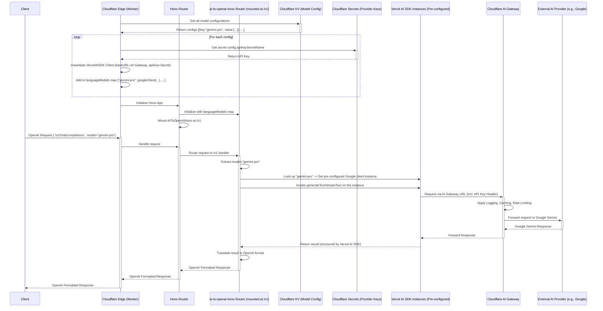

Okay, here is the standalone design and implementation plan for the OpenAI-compatible API gateway on Cloudflare Workers.

## 1. Architecture Overview and Diagram

### Key Components

1.  **Cloudflare Worker:** Hosts the Hono application. Its main responsibility is to initialize the `ai-to-openai-hono` middleware with the correct configuration, retrieving secrets and configuration as needed.
2.  **Hono:** A lightweight, fast web framework. Used as the base application to mount the `ai-to-openai-hono` router at the `/v1` path and potentially add other middleware (like client authentication).
3.  **`ai-to-openai-hono`:** The core component handling OpenAI compatibility. It's initialized with a map (`languageModels`) where keys are the OpenAI-compatible model names requested by clients (e.g., `"gemini-pro"`, `"claude-3-haiku"`) and values are the corresponding, pre-configured Vercel AI SDK provider instances. It manages routing requests under `/v1`, selecting the correct provider based on the `model` parameter, invoking it, and translating the response back into the OpenAI format. It can also handle client API key verification.
4.  **Vercel AI SDK:** Provider-specific clients (`@ai-sdk/google`, `@ai-sdk/anthropic`, etc.) instantiated *within* the Worker code. These instances are configured with the **Cloudflare AI Gateway `baseURL`** and the necessary API key retrieved from Cloudflare Secrets. They are passed to `ai-to-openai-hono` during its initialization.
5.  **Cloudflare AI Gateway:** The mandatory proxy for all calls to *external* AI model providers (Google, Anthropic, etc.). The Vercel AI SDK clients send requests *to* the AI Gateway, which then forwards them, providing centralized logging, caching, and rate limiting.
6.  **External AI Providers:** Third-party services like Google (Gemini), Anthropic (Claude), etc.
7.  **Cloudflare KV (Key-Value Store):** Stores the configuration mapping user-requested `model` names to provider details (provider identifier, actual model name for that provider, secret name, AI Gateway path segment). Allows dynamic updates to supported models.
8.  **Cloudflare Secrets:** Securely stores sensitive API keys for the external AI providers (e.g., `GOOGLE_API_KEY`, `ANTHROPIC_API_KEY`) and potentially client API keys.

### Data Flow Diagram



### Technology Integration

`ai-to-openai-hono` is configured upfront with a map of model names to *pre-initialized* Vercel AI SDK instances. These SDK instances are configured to point to the Cloudflare AI Gateway. `ai-to-openai-hono` acts as the router and translator based on the `model` parameter in the incoming OpenAI request.

### Security Considerations

*   **Provider API Keys:** Stored in Cloudflare Secrets, accessed via `env` in the Worker, and passed to Vercel AI SDK instances during initialization. The SDK includes these keys in requests to the Cloudflare AI Gateway.
*   **Client Authentication:** Implement using the `verifyAPIKey` option in `ai-to-openai-hono` or separate Hono middleware. Client keys can be stored in Secrets or KV.
*   **Rate Limiting:** Apply via Cloudflare AI Gateway (per provider) and/or in the Worker (per client key using KV).

## 2. Implementation Plan

**Phase 1: Project Setup & Basic Gemini Integration (Hardcoded Map)**

[x] 1.  **Initialize Project:**
    *   `npm create cloudflare@latest my-openai-gateway -- --type=hono`
    *   `cd my-openai-gateway`

[x] 2.  **Install Dependencies:**
    *   `npm install hono ai-to-openai-hono @ai-sdk/google zod`

[x] 3.  **Configure `wrangler.jsonc`:**
    *   Set `name`, `main = "src/index.ts"`, `compatibility_date`.

4.  **Set Up Secrets & Local Vars:**
    *   Get your Google AI Studio API Key.
    *   `npx wrangler secret put GOOGLE_API_KEY`
    *   Create `.dev.vars` for local testing:
        ```
        # .dev.vars
        GOOGLE_API_KEY="<YOUR_GOOGLE_API_KEY>"
        ```
    *   Add `.dev.vars` to `.gitignore`.

5.  **Initial Worker Code (`src/index.ts`):**
    ```typescript
    import { createGoogleGenerativeAI } from "@ai-sdk/google";
    import type { LanguageModelV1 } from "@ai-sdk/provider";
    import { createOpenAICompat } from "@ns/ai-to-openai-hono";
    import { Hono } from "hono";

    // Module-scoped map to store initialized models
    let modelsMap: Record<string, LanguageModelV1> = {};

    // Helper to initialize models - will be expanded in Phase 2
    async function initializeLanguageModels(env: CloudflareBindings): Promise<Record<string, LanguageModelV1>> {
        const models: Record<string, LanguageModelV1> = {};
        // Configure Google Gemini using AI Gateway
        if (env.AI && env.AI_GATEWAY_NAME && env.GOOGLE_API_KEY) {
            try {
                const gateway = env.AI.gateway(env.AI_GATEWAY_NAME);
                const googleURL = await gateway.getUrl("google-ai-studio");
                if (!googleURL) {
                    throw new Error("Failed to get Google AI Studio URL from AI Gateway.");
                }
                const token = env.AI_GATEWAY_TOKEN;
                const google = createGoogleGenerativeAI({
                    baseURL: `${googleURL}/v1beta`,
                    apiKey: env.GOOGLE_API_KEY,
                    headers: { "cf-aig-authorization": `Bearer ${token}` },
                });
                models["gemini-flash"] = google("gemini-2.0-flash");
            } catch (error) {
                console.error("Error initializing Google Gemini via AI Gateway:", error);
            }
        } else {
            console.warn(
                "Google Gemini provider not configured via AI Gateway due to missing bindings or environment variables/secrets (AI, AI_GATEWAY_NAME, GOOGLE_API_KEY).",
            );
        }
        return models;
    }

    const app = new Hono<{ Bindings: CloudflareBindings; Variables: { languageModels: Record<string, LanguageModelV1> } }>();

    app.use("*", async (c, next) => {
        if (Object.keys(modelsMap).length === 0) {
            modelsMap = await initializeLanguageModels(c.env);
        }
        await next();
    });

    const aiRouter = createOpenAICompat({
        languageModels: (modelId: string) => modelsMap[modelId] ?? null,
    });

    // Mount the AI router at the root path
    app.route("/", aiRouter);

    export default app;
    ```

6.  **Local Development & Testing:**
    *   Run `npx wrangler dev`.
    *   Send a `curl` request to `http://localhost:8787/v1/chat/completions` with `model: "gemini-flash"`.
        ```bash
        curl http://localhost:8787/v1/chat/completions \
          -H "Content-Type: application/json" \
          -d '{
            "model": "gemini-flash",
            "messages": [{"role": "user", "content": "Explain Cloudflare AI Gateway briefly."}],
            "max_tokens": 60
          }'
        ```
    *   Verify the response format and content. Check Cloudflare AI Gateway logs.

7.  **Deploy:**
    *   `npx wrangler deploy`
    *   Test the deployed endpoint.

## Provider/Model Format

Before diving into dynamic KV configuration, we'll switch to a provider-centric model format.

Clients must specify the `model` parameter as `<provider>/<modelName>` (e.g. `openai/gpt-4` or `google/chat-bison`). The gateway will:

1. Split the `model` string on `/` to extract `provider` and `modelName`.
2. Look up the provider configuration in KV (keyed by `provider`) to get credentials and gateway path.
3. Use the Vercel AI SDK for that provider to obtain a client factory.
4. Call the client factory with `modelName` at request time to instantiate a `LanguageModelV1`.

This lets us support any model from a configured provider without enumerating each model in KV.

### Local Testing Without KV

For initial testing, mirror the future KV-based `initializeProviders` but use a static config:

```ts
// Module-level cache
let providersMap: Record<string, (model: string) => LanguageModelV1> = {};
let providersInitializedAt = 0;
const CACHE_TTL_MS = 300_000;

// Static provider configuration
const staticProviderConfigs = [
  {
    provider: 'google',
    apiKey: env.GOOGLE_API_KEY,
    gatewayProviderPath: 'google/gemini',
  },
];

// Static initializeProviders that mimics KV loading
async function initializeProviders(env: CloudflareBindings): Promise<typeof providersMap> {
  const gateway = env.AI.gateway(env.AI_GATEWAY_NAME);
  const url = await gateway.getUrl(staticProviderConfigs[0].gatewayProviderPath);
  providersMap['google'] = createGoogleGenerativeAI({
    baseURL: `${url}/v1beta`,
    apiKey: staticProviderConfigs[0].apiKey,
    headers: { 'cf-aig-authorization': `Bearer ${env.AI_GATEWAY_TOKEN}` },
  });
  providersInitializedAt = Date.now();
  return providersMap;
}

// Middleware with TTL caching
app.use('*', async (c, next) => {
  const now = Date.now();
  if (!providersMap || now - providersInitializedAt > CACHE_TTL_MS) {
    await initializeProviders(c.env);
  }
  await next();
});

// Router using provider/model split
const aiRouter = createOpenAICompat({
  languageModels: (id) => {
    const [provider, modelName] = id.split('/');
    return providersMap[provider]?.(modelName) ?? null;
  },
});
app.route('/', aiRouter);
```

Run locally:
```bash
direnv exec . npx wrangler dev
curl http://localhost:8787/v1/chat/completions \
  -H "Content-Type: application/json" \
  -d '{"model":"google/gemini","messages":[{"role":"user","content":"Test gemini usage."}]}'
```

Once verified, replace the body of `initializeProviders` to read from KV as described below.

### High-Level Steps

1. Store provider configs in KV: key=`<provider>`, value=`{ provider, apiKeySecretName, gatewayProviderPath }`.
3. In KV initialization, load provider configs into a `providersMap: Record<string, (model: string) => LanguageModelV1>`.
4. Update the `languageModels` function to parse `<provider>/<modelName>` and call the matching factory.
5. Update caching/TTL logic to reload `providersMap` when expired.

## 2. Implementation Plan

**Phase 2: Dynamic Configuration with KV**

1.  **Bindings Update:**
    *   Add in `wrangler.jsonc`:
        ```jsonc
        {
          "kv_namespaces": [
            {
              "binding": "PROVIDER_CONFIG",
              "preview_id": "..."
            }
          ]
        }
        ```

2.  **Define Configuration Schema:**
```ts
interface ProviderConfig {
  provider: string;
  apiKeySecretName: string;
  gatewayProviderPath: string;
}
```

3.  **Async Initialization Function:**
```ts
// Module-level cache for provider factories
let providersMap: Record<string, (model: string) => LanguageModelV1> = {};
let providersInitializedAt = 0;
const CACHE_TTL_MS = Number(env.PROVIDER_CACHE_TTL_MS) || 300_000;

async function initializeProviders(env: CloudflareBindings): Promise<Record<string, (model: string) => LanguageModelV1>> {
  const providers: Record<string, (model: string) => LanguageModelV1> = {};
  try {
    const list = await env.PROVIDER_CONFIG.list();
    for (const { name: provider } of list.keys) {
      const raw = await env.PROVIDER_CONFIG.get(provider);
      if (!raw) continue;
      let cfg: ProviderConfig;
      try { cfg = JSON.parse(raw); }
      catch (e) {
        console.error(`Invalid JSON in PROVIDER_CONFIG for '${provider}':`, e);
        continue;
      }
      const gateway = env.AI.gateway(env.AI_GATEWAY_NAME);
      const url = await gateway.getUrl(cfg.gatewayProviderPath);
      if (!url) {
        console.error(`Failed to resolve gateway URL for '${cfg.gatewayProviderPath}'`);
        continue;
      }
      const headers = { 'cf-aig-authorization': `Bearer ${env.AI_GATEWAY_TOKEN}` };
      let clientFactory;
      switch (cfg.provider) {
        case 'google':
          clientFactory = createGoogleGenerativeAI({ baseURL: `${url}/v1beta`, apiKey: env[cfg.apiKeySecretName], headers });
          break;
        case 'openai':
          clientFactory = createOpenAI({ baseURL: `${url}/v1`, apiKey: env[cfg.apiKeySecretName], headers });
          break;
        default:
          console.warn(`Unsupported provider '${cfg.provider}'`);
          continue;
      }
      providers[provider] = clientFactory;
    }
    providersInitializedAt = Date.now();
    providersMap = providers;
  } catch (e) {
    console.error('Error initializing providers from KV:', e);
  }
  return providersMap;
}
```

4.  **Middleware with TTL Caching:**
```ts
app.use('*', async (c, next) => {
  const now = Date.now();
  if (!providersMap || now - providersInitializedAt > CACHE_TTL_MS) {
    await initializeProviders(c.env);
  }
  await next();
});
```

5.  **Create Router:**
```typescript
const aiRouter = createOpenAICompat({
  languageModels: (id) => {
    const [provider, modelName] = id.split('/');
    return providersMap[provider]?.(modelName) ?? null;
  },
});
app.route('/', aiRouter);
```

6.  **Testing & Error Scenarios:**
    *   Run `direnv exec . npx wrangler dev --remote`.
    *   Insert/update KV entries, e.g. `wrangler kv:key put --binding=PROVIDER_CONFIG google '{...}'`.
    *   Send test prompts to each model via `curl http://localhost:8787/v1/chat/completions -d '{"model":"<provider>/<modelName>","messages":[...]}'.`
    *   Verify valid responses and check logs for errors.
    *   Test invalid JSON in KV and ensure errors are logged without crashing.

7.  **Security Considerations:**
    *   Do not log secret values or tokens.
    *   Ensure `AI_GATEWAY_TOKEN` and API key secrets remain in environment and not in KV.
    *   Limit KV permissions appropriately and rotate tokens regularly.

**Phase 3: Add Anthropic Provider**

1.  **Set Up Secret:** `npx wrangler secret put ANTHROPIC_API_KEY`
2.  **Install SDK:** `npm install @ai-sdk/anthropic`
3.  **Update KV:** Add an entry for an Anthropic model (e.g., `claude-3-haiku`) to `provider_configs.json` and upload via `kv bulk put`. Ensure `provider`, `model`, `apiKeySecretName`, and `gatewayProviderPath` are correct for Anthropic and your AI Gateway setup.
4.  **Update Worker Code (`src/index.ts`):**
    *   Add `import { createAnthropic } from '@ai-sdk/anthropic';`.
    *   Add `ANTHROPIC_API_KEY: string;` to `Bindings`.
    *   Add a `case 'anthropic':` to the `switch` statement within `initializeProviders` to handle Anthropic client instantiation.
5.  **Test & Deploy:** Test with `model: "claude-3-haiku"` (or your configured name). Verify requests route correctly via AI Gateway to Anthropic.

**Phase 4: Implement Client API Key Verification**

1.  **Storage:**
    *   Create KV namespace: `npx wrangler kv namespace create CLIENT_KEYS`
    *   Add binding to `wrangler.jsonc`.
    *   Populate `CLIENT_KEYS` with valid client API keys (e.g., `wrangler kv key put --binding=CLIENT_KEYS <client_api_key> "true"`).

2.  **Update Worker Code (`src/index.ts`):**
    *   Add `CLIENT_KEYS: KVNamespace;` to the `Bindings` type.
    *   Implement the `verifyAPIKey` function within the `createOpenAICompat` options:
        ```typescript
        const aiRouter = createOpenAICompat({
          languageModels: (id) => {
            const [provider, modelName] = id.split('/');
            return providersMap[provider]?.(modelName) ?? null;
          },
          async verifyAPIKey(key, c) { // Hono context 'c' is passed
            if (!c) return false;
            const env = c.env as Bindings; // Access env via context
            try {
              const clientData = await env.CLIENT_KEYS.get(key);
              return clientData !== null; // Key exists in KV
            } catch (e) {
              console.error("Error verifying client API key:", e);
              return false;
            }
          },
        });
        ```
3.  **Test & Deploy:** Deploy the updated Worker. Clients now need to include a valid `Authorization: Bearer <client_key>` header where `<client_key>` exists in the `CLIENT_KEYS` KV namespace. Test with and without valid keys.