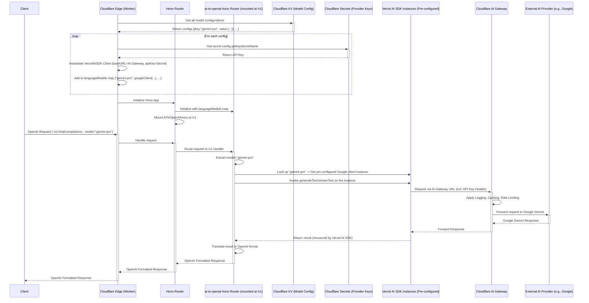

Okay, here is the standalone design and implementation plan for the OpenAI-compatible API gateway on Cloudflare Workers.

## 1. Architecture Overview and Diagram

### Key Components

1.  **Cloudflare Worker:** Hosts the Hono application. Its main responsibility is to initialize the `ai-to-openai-hono` middleware with the correct configuration, retrieving secrets and configuration as needed.
2.  **Hono:** A lightweight, fast web framework. Used as the base application to mount the `ai-to-openai-hono` router at the `/v1` path and potentially add other middleware (like client authentication).
3.  **`ai-to-openai-hono`:** The core component handling OpenAI compatibility. It's initialized with a map (`languageModels`) where keys are the OpenAI-compatible model names requested by clients (e.g., `"gemini-pro"`, `"claude-3-haiku"`) and values are the corresponding, pre-configured Vercel AI SDK provider instances. It manages routing requests under `/v1`, selecting the correct provider based on the `model` parameter, invoking it, and translating the response back into the OpenAI format. It can also handle client API key verification.
4.  **Vercel AI SDK:** Provider-specific clients (`@ai-sdk/google`, `@ai-sdk/anthropic`, etc.) instantiated *within* the Worker code. These instances are configured with the **Cloudflare AI Gateway `baseURL`** and the necessary API key retrieved from Cloudflare Secrets. They are passed to `ai-to-openai-hono` during its initialization.
5.  **Cloudflare AI Gateway:** The mandatory proxy for all calls to *external* AI model providers (Google, Anthropic, etc.). The Vercel AI SDK clients send requests *to* the AI Gateway, which then forwards them, providing centralized logging, caching, and rate limiting.
6.  **External AI Providers:** Third-party services like Google (Gemini), Anthropic (Claude), etc.
7.  **Cloudflare KV (Key-Value Store):** Stores the configuration mapping user-requested `model` names to provider details (provider identifier, actual model name for that provider, secret name, AI Gateway path segment). Allows dynamic updates to supported models.
8.  **Cloudflare Secrets:** Securely stores sensitive API keys for the external AI providers (e.g., `GOOGLE_API_KEY`, `ANTHROPIC_API_KEY`) and potentially client API keys.

### Data Flow Diagram



### Technology Integration

`ai-to-openai-hono` is configured upfront with a map of model names to *pre-initialized* Vercel AI SDK instances. These SDK instances are configured to point to the Cloudflare AI Gateway. `ai-to-openai-hono` acts as the router and translator based on the `model` parameter in the incoming OpenAI request.

### Security Considerations

*   **Provider API Keys:** Stored in Cloudflare Secrets, accessed via `env` in the Worker, and passed to Vercel AI SDK instances during initialization. The SDK includes these keys in requests to the Cloudflare AI Gateway.
*   **Client Authentication:** Implement using the `verifyAPIKey` option in `ai-to-openai-hono` or separate Hono middleware. Client keys can be stored in Secrets or KV.
*   **Rate Limiting:** Apply via Cloudflare AI Gateway (per provider) and/or in the Worker (per client key using KV).

## 2. Implementation Plan

**Phase 1: Project Setup & Basic Gemini Integration (Hardcoded Map)**

[x] 1.  **Initialize Project:**
    *   `npm create cloudflare@latest my-openai-gateway -- --type=hono`
    *   `cd my-openai-gateway`

[x] 2.  **Install Dependencies:**
    *   `npm install hono ai-to-openai-hono @ai-sdk/google zod`

[x] 3.  **Configure `wrangler.toml`:**
    *   Set `name`, `main = "src/index.ts"`, `compatibility_date`.

4.  **Set Up Secrets & Local Vars:**
    *   Get your Google AI Studio API Key.
    *   `npx wrangler secret put GOOGLE_API_KEY`
    *   Create `.dev.vars` for local testing:
        ```
        # .dev.vars
        GOOGLE_API_KEY="<YOUR_GOOGLE_API_KEY>"
        ```
    *   Add `.dev.vars` to `.gitignore`.

5.  **Initial Worker Code (`src/index.ts`):**
    ```typescript
    import { Hono } from 'hono';
    import { createOpenAIHono } from 'ai-to-openai-hono';
    import { createGoogleGenerativeAI } from '@ai-sdk/google';
    import { LanguageModel } from '@ai-sdk/provider';

    type Bindings = {
      GOOGLE_API_KEY: string;
      CLOUDFLARE_ACCOUNT_ID: string;
      CLOUDFLARE_AI_GATEWAY: string;
      // Add KV binding later: MODEL_CONFIG: KVNamespace;
    };

    const app = new Hono<{ Bindings: Bindings }>();

    // Helper to initialize models - will be expanded in Phase 2
    function initializeLanguageModels(env: Bindings): Record<string, LanguageModel> {
        const models: Record<string, LanguageModel> = {};

        // Configure Google Gemini (Hardcoded for Phase 1)
        if (env.GOOGLE_API_KEY && env.CLOUDFLARE_ACCOUNT_ID && env.CLOUDFLARE_AI_GATEWAY) {
            const google = createGoogleGenerativeAI({
                baseURL: `https://gateway.ai.cloudflare.com/v1/${env.CLOUDFLARE_ACCOUNT_ID}/${env.CLOUDFLARE_AI_GATEWAY}/google-ai-studio/v1beta`,
                apiKey: env.GOOGLE_API_KEY,
            });
            // Map user-facing name "gemini-pro" to the actual Google model instance
            models['gemini-pro'] = google('gemini-1.5-pro-latest'); // Use the actual model name
        } else {
            console.warn("Google Gemini provider not configured due to missing environment variables/secrets.");
        }
        // Add more providers here in later phases
        return models;
    }

    // Middleware to initialize models and store them in context
    // This ensures 'env' is available during initialization
    app.use('*', async (c, next) => {
        if (!c.get('languageModels')) {
             // In a real app, consider caching this initialization result
             const models = initializeLanguageModels(c.env);
             c.set('languageModels', models);
        }
        await next();
    });

    // Create the OpenAI-compatible router
    const aiRouter = createOpenAIHono({
        // Retrieve the initialized models map from context for each request
        getLanguageModels: (c) => {
            const models = c.get('languageModels');
            if (!models) {
                console.error("Language models not initialized in context!");
                return {}; // Return empty or throw error
            }
            return models;
        },
        // Optional: Add API key verification later
        // verifyAPIKey(key, c) { ... }
    });

    // Mount the AI router at the /v1 path
    app.route('/v1', aiRouter);

    // Basic health check endpoint
    app.get('/', (c) => c.text('OpenAI Compatible Gateway Running'));

    export default app;
    ```

6.  **Local Development & Testing:**
    *   Run `npx wrangler dev`.
    *   Send a `curl` request to `http://localhost:8787/v1/chat/completions` with `model: "gemini-pro"`.
        ```bash
        curl http://localhost:8787/v1/chat/completions \
          -H "Content-Type: application/json" \
          -d '{
            "model": "gemini-pro",
            "messages": [{"role": "user", "content": "Explain Cloudflare AI Gateway briefly."}],
            "max_tokens": 60
          }'
        ```
    *   Verify the response format and content. Check Cloudflare AI Gateway logs.

7.  **Deploy:**
    *   `npx wrangler deploy`
    *   Test the deployed endpoint.

**Phase 2: Dynamic Configuration with KV**

1.  **Create KV Namespace:**
    *   `npx wrangler kv namespace create MODEL_CONFIG`
    *   Add the binding (including `preview_id`) to `wrangler.toml`.

2.  **Populate KV:**
    *   Define `model_configs.json` mapping user-facing names to provider details:
        ```json
        [
          {
            "key": "gemini-pro",
            "value": "{\"provider\":\"google\",\"model\":\"gemini-1.5-pro-latest\",\"apiKeySecretName\":\"GOOGLE_API_KEY\",\"gatewayProviderPath\":\"google-ai-studio/v1beta\"}"
          }
          // Add more model configs here
        ]
        ```
    *   Upload: `npx wrangler kv bulk put --binding=MODEL_CONFIG model_configs.json`

3.  **Update Worker Code (`src/index.ts`):**
    *   Add `MODEL_CONFIG: KVNamespace;` to the `Bindings` type.
    *   Create/Modify a function `initializeModelsFromKV(env)`:
        *   This function will list keys from `env.MODEL_CONFIG`.
        *   For each key, get the config string, parse the JSON (`ModelConfig` type).
        *   Retrieve the API key: `const apiKey = env[config.apiKeySecretName];`.
        *   Construct the AI Gateway `baseURL`.
        *   Use a `switch(config.provider)` to instantiate the correct Vercel AI SDK client (`createGoogleGenerativeAI`, etc.).
        *   Add the configured provider instance to the `models` map: `models[keyName] = providerInstance(config.model);`.
        *   Return the `models` map.
    *   Update the middleware (`app.use`) to call `initializeModelsFromKV` instead of the hardcoded version.
    *   Implement caching for the KV results within the Worker instance if desired (e.g., using a global variable with a simple TTL check) to reduce KV reads.

4.  **Test & Deploy:** Test locally (`wrangler dev --remote` recommended for KV access) and deploy. Verify `gemini-pro` still works and that the configuration is read from KV.

**Phase 3: Add Anthropic Provider**

1.  **Set Up Secret:** `npx wrangler secret put ANTHROPIC_API_KEY`
2.  **Install SDK:** `npm install @ai-sdk/anthropic`
3.  **Update KV:** Add an entry for an Anthropic model (e.g., `claude-3-haiku`) to `model_configs.json` and upload via `kv bulk put`. Ensure `provider`, `model`, `apiKeySecretName`, and `gatewayProviderPath` are correct for Anthropic and your AI Gateway setup.
4.  **Update Worker Code (`src/index.ts`):**
    *   Add `import { createAnthropic } from '@ai-sdk/anthropic';`.
    *   Add `ANTHROPIC_API_KEY: string;` to `Bindings`.
    *   Add a `case 'anthropic':` to the `switch` statement within `initializeModelsFromKV` to handle Anthropic client instantiation.
5.  **Test & Deploy:** Test with `model: "claude-3-haiku"` (or your configured name). Verify requests route correctly via AI Gateway to Anthropic.

**Phase 4: Implement Client API Key Verification**

1.  **Storage:**
    *   Create KV namespace: `npx wrangler kv namespace create CLIENT_KEYS`
    *   Add binding to `wrangler.toml`.
    *   Populate `CLIENT_KEYS` with valid client API keys (e.g., `wrangler kv key put --binding=CLIENT_KEYS <client_api_key> "true"`).

2.  **Update Worker Code (`src/index.ts`):**
    *   Add `CLIENT_KEYS: KVNamespace;` to the `Bindings` type.
    *   Implement the `verifyAPIKey` function within the `createOpenAIHono` options:
        ```typescript
        const aiRouter = createOpenAIHono({
            getLanguageModels: (c) => c.get('languageModels'),
            async verifyAPIKey(key, c) { // Hono context 'c' is passed
                if (!c) return false;
                const env = c.env as Bindings; // Access env via context
                try {
                    const clientData = await env.CLIENT_KEYS.get(key);
                    return clientData !== null; // Key exists in KV
                } catch (e) {
                    console.error("Error verifying client API key:", e);
                    return false;
                }
            },
        });
        ```
3.  **Test & Deploy:** Deploy the updated Worker. Clients now need to include a valid `Authorization: Bearer <client_key>` header where `<client_key>` exists in the `CLIENT_KEYS` KV namespace. Test with and without valid keys.